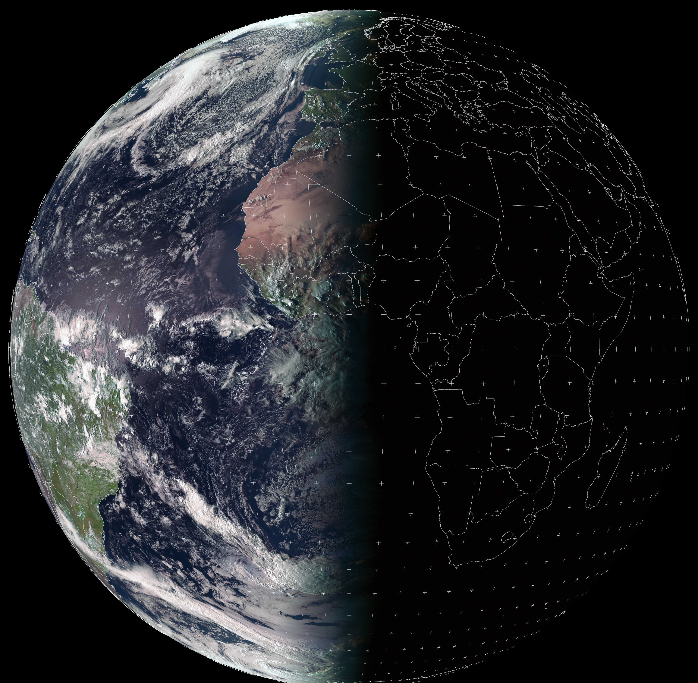

# Earth Picture

> _Users can find earth pictures **useful**, or just **beautiful**_.

____

## Description

Earth Picture is a java application for android powered devices.

The application provide pictures from [EUropean METeo SATellites](https://www.eumetsat.int "EUMETSAT website").
The application will download the most recent picture from the selected satellite source, allowing to:
* display the picture in a ImageView component,
* zoom in/out the picture,
* crop the picture,
* apply the picture as device wallpaper.

____

## Preview example

<figure>
	
	<figcaption>Dusk at Bordeaux</figcaption>
</figure>

____

## Characteristics

### Image preview

#### Actions menu

- **Sync**: Download the latest image from the selected source.
- **Crop**: Crop the displayed image on ImageView borders.
- **Set as Wallpaper**: Apply the image as device wallpaper.
- **Set as live Wallpaper**:  Apply the image source as device live wallpaper.

#### Preview

Once an [image source is selected](#Source_selection), the ImageView component displays the most up to date picture from [EUropean METeo SATellites](https://www.eumetsat.int "EUMETSAT website").
The image can be scrolled and pinched to zoom on user's prefered area.

### Settings

#### Source selection

Two choices are to be made when selecting a source:

1. Satellite location

   Pictures are all taken from 0° latitude (above earth's equator). 

   0° or 45° longitudes can be selected in order to get pictures respectively centered above metropolitan France or above La Réunion.

1. Image processing type

   EUMETSAT provide several sensors processing traditionally used for meteorological data analysis and previsions.

   Users select one resulting image as a source:
   - Atmospheric Motion Vectors,
   - Fire,
   - Precipitation rate at ground,
   - Infrared,
   - Multi-Sensor Precipitation Estimate,
   - Airmass,
   - Ash,
   - Convection,
   - Dust,
   - EView,
   - Fog,
   - Microphysics,
   - Natural Colour,
   - Solar Day,
   - Tropical Airmass,
   - Water Vapor.

#### Synchronization mode

This option controls wallpaper refresh mode.

_Mode_             | _Description_
:----------------: | -------------
**Off**            | User can apply the previewed image as wallpaper without further synchronization.
**Wallpaper**      | The most up to date source is applied as basic wallpaper. This mode uses background processing and may interfere with android power management and battery saving.
**Live Wallpaper** | The most up to date source is applied as live wallpaper.

#### Refresh rate

This option controls the wallpaper synchronization period.
Users can choose between 15mn, 30mn, 1h, 6h, 12h or 24h.

#### Remember last crop area

This option controls wether the wallpaper synchronization shall apply the same crop for futures wallpapers.
